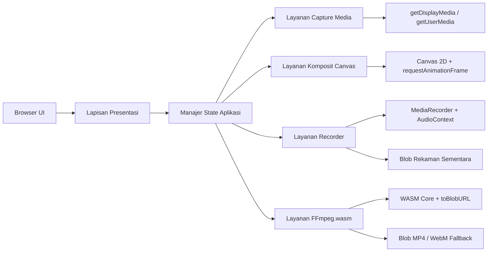

## 1. Desain Arsitektur


## 2. Deskripsi Teknologi
- Frontend: TypeScript ketat + Vite + vanilla DOM API.
- Perekaman media: `MediaDevices.getDisplayMedia`, `MediaDevices.getUserMedia`, `MediaRecorder`, `HTMLCanvasElement.captureStream`.
- Komposit video: `CanvasRenderingContext2D` pada visible canvas dengan loop `requestAnimationFrame`.
- Audio: `AudioContext`, `MediaStreamAudioSourceNode`, `MediaStreamDestination`, `AnalyserNode`.
- Pemrosesan video: `@ffmpeg/ffmpeg` + `@ffmpeg/util` dimuat malas saat stop recording.
- Styling: CSS modular sederhana berbasis variabel tema global, tanpa framework UI.
- Build tool: Vite dengan header COOP/COEP pada dev server untuk dukungan FFmpeg.wasm.

## 3. Definisi Rute
| Rute | Tujuan |
|------|--------|
| / | Halaman tunggal RecStudio untuk preview, perekaman, pemrosesan, dan hasil unduhan. |

## 4. Definisi API Internal
Tidak ada backend atau API jaringan khusus. Semua proses berjalan di browser.

### 4.1 Kontrak Tipe Inti
```ts
type RecorderState = 'idle' | 'requesting-permissions' | 'recording' | 'processing' | 'done';

interface OverlayPosition {
  x: number;
  y: number;
  width: number;
  height: number;
}

interface RecordingResult {
  blob: Blob;
  mimeType: string;
  fileName: string;
  objectUrl: string;
  sizeBytes: number;
  usedFallback: boolean;
}

interface CaptureOptions {
  includeWebcam: boolean;
  includeMicrophone: boolean;
}
```

## 5. Struktur Modul Frontend
| File | Tanggung jawab |
|------|----------------|
| `src/main.ts` | Bootstrap aplikasi, inisialisasi UI, wiring event antarmodul, serta orkestrasi browser Picture-in-Picture. |
| `src/types.ts` | Enum, interface, dan kontrak data bersama. |
| `src/ui.ts` | Render elemen UI, state label, toast, timer, meter audio, dan area hasil. |
| `src/canvas.ts` | Menggambar screen dan webcam ke canvas, mengelola drag overlay dan RAF loop. |
| `src/recorder.ts` | Meminta izin media, menyiapkan mixing audio, membuat `MediaRecorder`, mengelola chunks, serta cleanup track. |
| `src/ffmpeg.ts` | Lazy-load FFmpeg, remux/convert WebM ke MP4, fallback saat konversi gagal. |
| `src/style.css` | Tema visual, layout studio gelap, animasi, komponen, dan responsivitas. |
| `index.html` | Kerangka root aplikasi dan metadata halaman. |
| `vite.config.ts` | Header cross-origin, konfigurasi dev server, dan opsi build dasar. |

## 6. Alur Runtime
1. `main.ts` membuat instance pengelola UI, kompositor canvas, dan service recorder.
2. Saat tombol mulai diklik, state berubah ke `requesting-permissions`.
3. `recorder.ts` meminta stream layar, webcam opsional, dan mikrofon opsional.
4. `canvas.ts` menyesuaikan resolusi canvas dengan screen track, maksimal 1920x1080.
5. `canvas.ts` memulai loop gambar untuk me-render layar dan webcam overlay.
6. `recorder.ts` membuat stream output dari canvas dan mencampur audio mikrofon ke `MediaStreamDestination`.
7. `MediaRecorder` merekam stream komposit dalam `video/mp4` jika didukung, jika tidak maka `video/webm`.
8. Saat berhenti, semua track dihentikan, loop dihentikan, dan blob hasil dikirim ke `ffmpeg.ts`.
9. `ffmpeg.ts` memuat core wasm secara lazy lalu menghasilkan file MP4; jika gagal, blob mentah tetap tersedia.
10. `ui.ts` menampilkan preview, ukuran file, tombol unduh hasil, dan kontrol Picture-in-Picture.
11. `main.ts` mengelola proxy `<video>` tersembunyi dari `canvas.captureStream()` untuk Live PiP dan memakai `<video>` hasil rekaman untuk Result PiP.

## 7. Penanganan Error
- Jika izin screen ditolak, tampilkan toast `Screen access was denied` dan kembali ke state `idle`.
- Jika izin webcam ditolak, nonaktifkan webcam dan lanjutkan merekam screen saja.
- Jika izin mikrofon ditolak, nonaktifkan mikrofon, tampilkan peringatan, dan lanjutkan tanpa audio mic.
- Jika MIME `video/mp4` tidak didukung `MediaRecorder`, fallback otomatis ke `video/webm`.
- Jika FFmpeg gagal dimuat atau gagal memproses, tampilkan pesan fallback dan tawarkan unduhan file WebM.
- Jika browser tidak mendukung Picture-in-Picture, nonaktifkan tombol PiP dan pertahankan alur utama tanpa error.

## 8. Strategi Kualitas
- Aktifkan `strict` pada TypeScript untuk keamanan tipe.
- Pisahkan state machine agar transisi UI dapat diuji dan dirawat.
- Pastikan cleanup `MediaStreamTrack`, `AudioContext`, `requestAnimationFrame`, dan `objectURL` berjalan pada stop serta unload.
- Lakukan validasi dukungan browser untuk `MediaRecorder`, `getDisplayMedia`, dan `captureStream` sebelum memulai proses.
