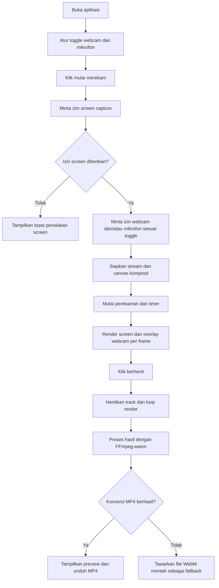

## 1. Ringkasan Produk
RecStudio adalah aplikasi web perekam layar yang menggabungkan tangkapan screen, overlay webcam, dan audio mikrofon menjadi satu file video yang bisa diunduh.
- Produk ditujukan untuk kreator demo, tutor, presenter, dan pekerja remote yang membutuhkan perekaman layar cepat tanpa aplikasi desktop.
- Nilai utama produk adalah proses rekam-ke-ekspor yang ringkas, preview langsung, dan hasil akhir MP4 yang siap dibagikan.

## 2. Fitur Inti

### 2.1 Modul Fitur
1. **Halaman utama**: header aplikasi, canvas preview, status perekaman, panel kontrol, area hasil rekaman.

### 2.2 Detail Halaman
| Nama Halaman | Nama Modul | Deskripsi fitur |
|--------------|------------|-----------------|
| Halaman utama | Header studio | Menampilkan nama produk `RecStudio`, status aplikasi, dan nuansa visual studio gelap. |
| Halaman utama | Canvas preview | Menampilkan preview gabungan screen capture sebagai latar dan webcam overlay yang bisa diaktifkan/nonaktifkan. |
| Halaman utama | Overlay webcam | Menampilkan webcam dalam frame bulat atau rounded rectangle, posisi default di kanan bawah, dan dapat di-drag ke area mana pun di canvas. |
| Halaman utama | Panel kontrol | Tombol mulai/berhenti rekam, toggle webcam, toggle mikrofon, meter level audio, serta timer format MM:SS. |
| Halaman utama | Status proses | Menampilkan state `idle`, `requesting-permissions`, `recording`, `processing`, dan `done`, termasuk spinner saat FFmpeg memproses video. |
| Halaman utama | Hasil rekaman | Menampilkan video hasil, ukuran file, format hasil, dan tombol unduh MP4. |
| Halaman utama | Penanganan error | Menampilkan toast/peringatan jika izin screen atau mic ditolak, fallback bila MP4 langsung tidak didukung, dan opsi unduh WebM jika konversi gagal. |

## 3. Alur Inti
Pengguna membuka halaman utama, memilih untuk merekam layar, lalu aplikasi meminta izin screen capture. Jika toggle webcam aktif, aplikasi meminta akses kamera; jika toggle mic aktif, aplikasi meminta akses mikrofon dan mulai membaca level audio. Setelah semua sumber siap, aplikasi menggambar hasil komposit screen dan webcam ke canvas secara real-time, lalu merekam stream canvas plus audio campuran. Saat pengguna menghentikan rekaman, aplikasi membersihkan resource, memproses file rekaman dengan FFmpeg.wasm jika perlu, lalu menampilkan preview dan menyediakan tombol unduh MP4.

## 4. Desain Antarmuka
### 4.1 Gaya Desain
- Warna utama: latar `#0D0D0F`, panel `#15161A`, teks utama `#F5F7FA`, aksen rekam `#FF4D5A`, aksen sekunder `#6EE7B7`.
- Gaya tombol: rounded pill dengan glow halus, state aktif jelas, dan animasi pulse untuk indikator rekam.
- Tipografi: display monospace modern untuk identitas produk, sans-serif teknis yang bersih untuk kontrol dan status.
- Tata letak: desktop-first, satu halaman dengan header ringkas, preview besar di tengah, control bar mengambang di bawah preview, dan area hasil di bagian bawah.
- Ikon: gunakan ikon berbasis CSS/SVG sederhana agar konsisten dengan nuansa studio utilitarian.

### 4.2 Ringkasan Desain Halaman
| Nama Halaman | Nama Modul | Elemen UI |
|--------------|------------|-----------|
| Halaman utama | Header studio | Judul besar, label state, subteks ringkas, garis dekoratif halus. |
| Halaman utama | Canvas preview | Rasio 16:9, bingkai panel gelap, grid/scanline tipis, indikator live kecil saat recording. |
| Halaman utama | Overlay webcam | Frame rounded dengan border bercahaya, shadow lembut, area drag responsif. |
| Halaman utama | Panel kontrol | Tombol primer start/stop, switch webcam, switch mic, meter audio horizontal, timer digital. |
| Halaman utama | Status proses | Spinner processing, teks status, dan pesan fallback/error yang kontras namun tidak mengganggu. |
| Halaman utama | Hasil rekaman | Player video, label ukuran file, tombol unduh utama, kartu informasi hasil. |

### 4.3 Responsivitas
- Pendekatan desktop-first dengan pengalaman optimal pada layar laptop/desktop.
- Pada tablet dan mobile lebar kecil, canvas dan panel kontrol turun secara vertikal tanpa mengubah alur.
- Area drag webcam tetap dibatasi dalam kanvas pada semua ukuran layar.
- Target browser modern Chrome dan Edge versi desktop; pengalaman mobile dianggap sekunder.
